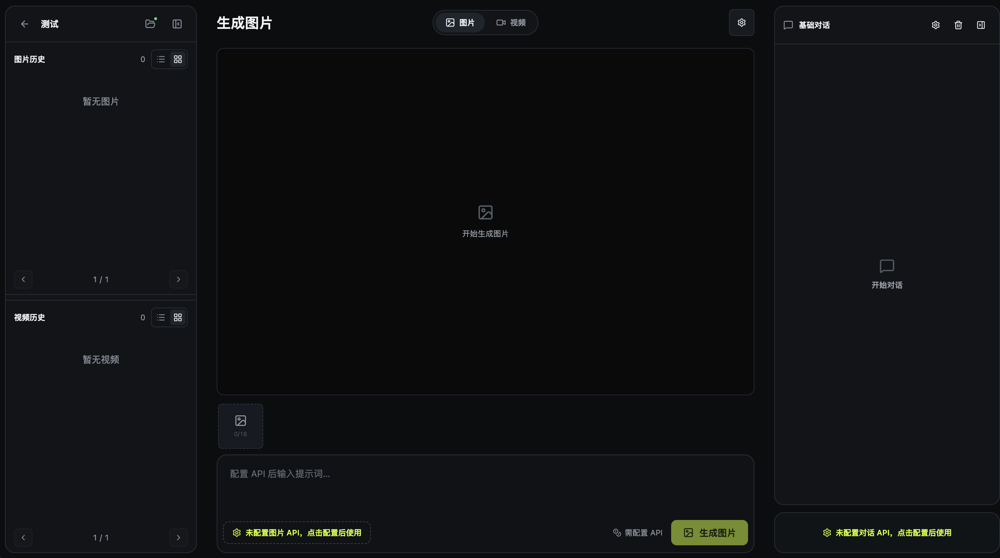
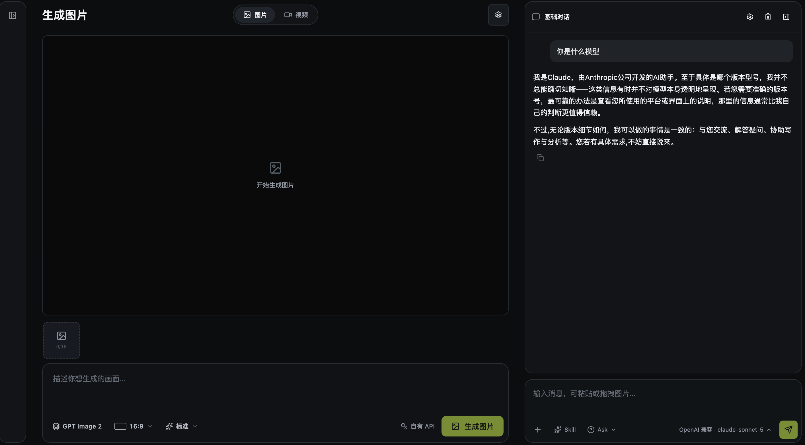
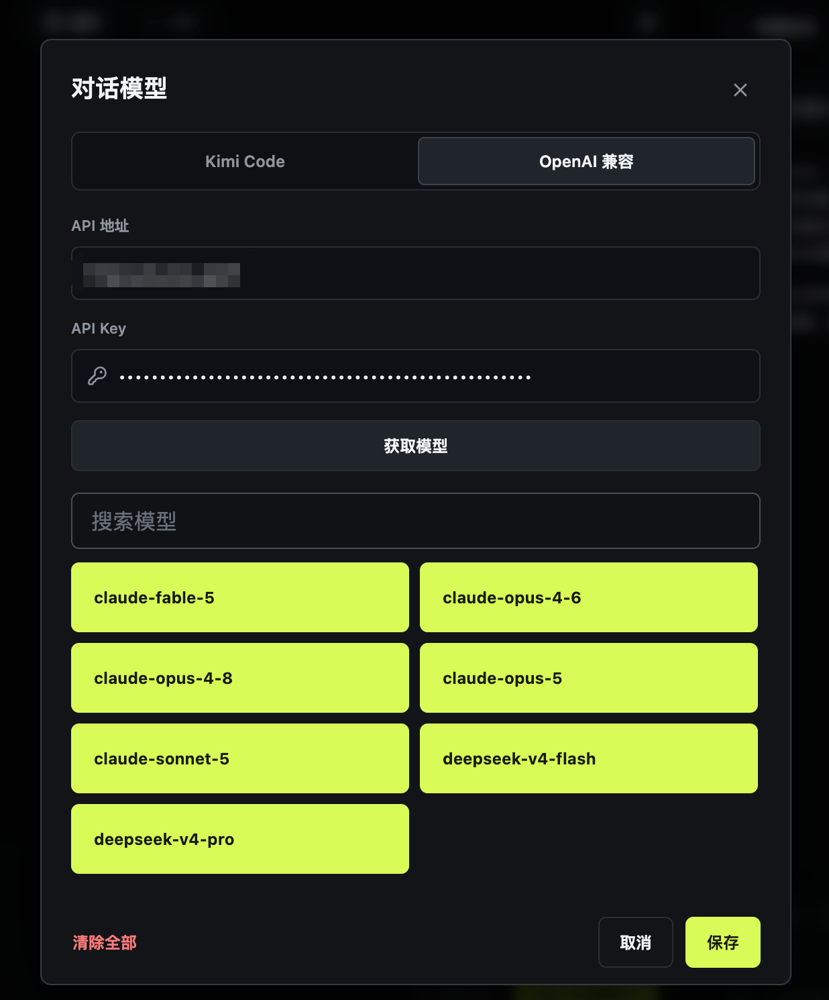

# OpenFlow

**一个可接入自有 API、可在本地运行、也可自行部署的 AI 创作基座。**

[在线体验](https://openflow.wtf) · [API 接入说明](PROVIDER_SETUP.md) · [参与贡献](CONTRIBUTING.md) · [MIT License](LICENSE)

## 为什么需要它

我们很容易获得对话、图片或视频模型的 API，却不容易获得一个稳定的工作空间。对话、图片和视频散落在不同网站，模型越来越多，创作过程反而越来越零散。

OpenFlow 从一个朴素的判断出发：API 可以更换，工作空间不应随之更换。它把对话、图片和视频放进同一个项目，让提示词、参考素材与生成记录保持连续。提供稳定的界面和工作流，把选择 API 的权利留给用户。

你可以在自己的电脑上运行，也可以部署到服务器上，与朋友或小团队共用同一个入口。每个人使用自己的 API，项目与历史默认保存在各自的浏览器中。当前版本不是多人协作文档，成员之间不会自动共享项目。

## 它对谁有用

- 已经拥有 AI API，希望统一使用对话、图片和视频模型的创作者。
- 在意素材归属，希望把项目和生成文件留在本地的人。
- 想为自己、朋友或团队部署一套轻量 AI 工具的开发者。
- 希望为自己的模型 API 提供开源客户端的服务商。

## 可以做什么

- 在项目中进行流式对话，并携带图片让模型分析。
- 生成和编辑图片，创建视频任务，使用多种参考素材。
- 查询异步任务进度，保存并复用历史素材。
- 分别配置自己的对话、图片和视频 API。
- 将项目记录保存在浏览器，并把媒体保存到自己选择的本机目录。

## 界面预览

### 统一的项目工作台



### 一边对话，一边创作



### 接入自己的模型

<p align="center">
  
</p>

## 在线体验

演示地址：**[https://openflow.wtf](https://openflow.wtf)**

创建项目，再配置自己的 Base URL、API Key 和模型名称即可使用。演示站不提供模型额度，生成费用由上游服务决定。

API Key 保存在当前浏览器中，重要项目不要只依赖浏览器缓存，应及时保存到本机目录。

## 本地运行

需要 Node.js 22.15 或更高版本。下载项目后执行：

```bash
npm install
cp .env.example .env.local
npm run dev
```

然后打开 [http://localhost:3000](http://localhost:3000)。生产部署使用：

```bash
npm run build
npm run start
```

部署图片或视频参考素材功能时，还需要按照 `.env.example` 配置签名密钥和公开访问地址。

## 接入新的 API

模型 ID 会按用户填写的内容原样发送。对话模型可以直接拉取或手动添加；图片和视频模型还需要选择与上游文档一致的接口方式和能力模板。不同服务可能使用不同的字段、任务状态和结果格式，现有接口方式不兼容时，打开 [PROVIDER_SETUP.md](PROVIDER_SETUP.md)，填入文档地址，再把其中的指令交给 AI 编程助手完成适配和测试。

不要把真实 API Key 写进文档、源码或提交记录。密钥应在适配完成后，由用户自己填入 OpenFlow。

## 数据与边界

项目与生成记录保存在浏览器中，媒体也可以写入用户授权的本机目录。API 请求经过当前 OpenFlow 部署的无状态代理，再转发到用户选择的服务。

开源版没有账号数据库、遥测、计费、支付、兑换码、平台密钥、内置中转站或私人模型清单。公开部署时，部署者仍应为访问入口和临时素材增加适当保护。详细说明见 [SECURITY.md](SECURITY.md)。

## 开发与协议

提交代码前请运行：

```bash
npm run typecheck
npm run lint
npm test
npm run build
```

OpenFlow 使用 [MIT License](LICENSE) 开源。你可以自由使用、修改、分发，也可以用于商业项目；发布副本或重要部分时，需要保留原版权声明和许可证文本。参与项目请阅读 [CONTRIBUTING.md](CONTRIBUTING.md)。
